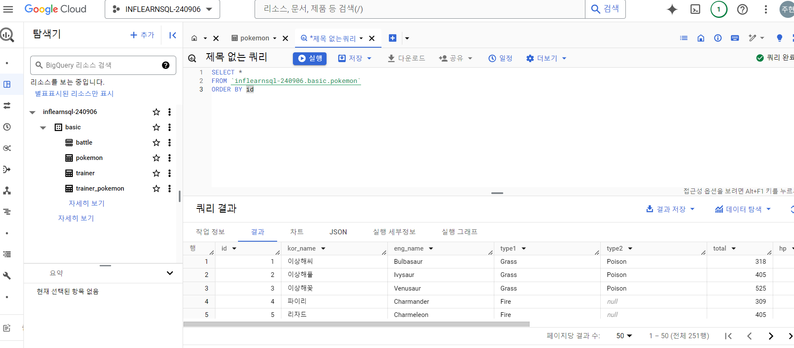
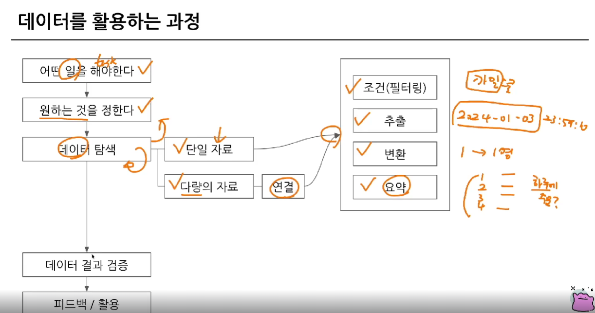
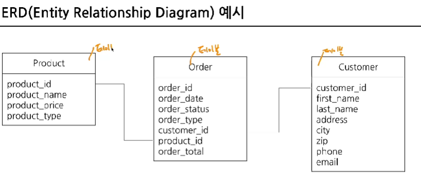

# 1-1. BigQuery 기초지식 
## 데이터 저장 형태
- Database: 데이터의 저장소
- Table: 데이터가 저장된 공간
- 저장된 데이터 => 제품(앱, 웹)에서 사용

- ex) 음식 배달 서비스의 데이터: 유저, 음식, 음식점, 라이더 등 

- 데이터가 저장되는 장소
    - mySQL, Oracle, PostgreSQL 등..
    - 클라우드 사용시 AWS Aurora 등? 

### OLTP란?
- Online Transaction Processing
- **거래**를 하기 위해 사용되는 데이터베이스
- MYSQL, ORACLE 등은 OLTP
- 보류, 중간 상태가 없음
- 주문을 완료하거나, 안하거나 (=>데이터가 무결)
- 데이터의 추가(INSERT), 데이터의 변경(UPDATE) 많이 발생
- 분석을 위해 만든 DB가 아님(트랜잭션을 위한것) -> 쿼리 속도가 느릴 수 있음

### SQL
- DB에서 데이터를 가지고 올때 사용하는 언어
- DB의 데이터를 관리하기 위해 설계된 프밍 언어
- 쿼리문, 쿼리를 짠다, SQL 쿼리 등으로 표현

### OLAP와 DW의 등장

- OLTP의 속도, 기능 부족 이슈로 등장

- OLAP: 분석을 위한 기능 제공
- DW: 데이터 웨어하우스
    - 데이터를 한곳에 모아 저장
    - DB, 웹(크롤링), 파일, API 결과 등

## BigQuery 

- 구글 클라우드의 OLAP 겸 DW가 BigQuery

    1. 난이도: SQL 통해 쉽게 데이터 추출 가능
    2. 속도: OLAP 도구라서 빠름 (단, 그만큼 돈 지불)
    3. Firebase, GA4 의 데이터 쉽게 추출 가능
    4. DW를 관리하기 위해 서버 띄울 필요X, 구글에서 인프라 관리 

---------------------------------------------------------

---------------------------------------------------------
# 1-2. BigQuery 환경 설정

    ** 강의 자료 압축 풀기 했는데 빈 파일일때 (맥 환경에서 압축한 파일이 윈도우에서 깨짐) => '**반디집으로 압축풀기**' 하면 됨!

<환경설정 완료한 모습 캡쳐>

    ※ **github 커밋 시 주의사항..**※ 
    - 이미지파일 이름은 띄어쓰기 없도록
    - 사진을 이미지 폴더에 넣고 => 커밋 한번 하고 => 그다음 이미지 경로 넣어서 삽입 => 커밋 

# 2-1. 데이터 활용 Overview

# 2-2.저장된 데이터 활용하기 

## sql 쿼리를 작성하기 전에
- 데이터가 어떻게 저장되어있는가?
- 어떤 데이터가 저장되어 있는가?
- 컬럼의 의미는 무엇인가?

### 데이터가 저장되는 형태를 알려면?

- **ERD** : 데이터베이스 구조를 한눈에 알아보기 위해 사용
- 회사마다 있을 수도 있고, 없을 수도 있음

<ERD 예시>

### 포켓몬 세상을 데이터로 생각해보기

? 포켓몬 세상엔 어떤 데이터가 존재할까요 ?

    - 포켓몬
    - 트레이너
    - 트레이너가 잡은 포켓몬
    - 트레이너가 도전한 유저 배틀
    - 트레이너가 도전한 체육관 배틀
    - NPC
    - 상점
    - 상점별로 판매하는 제품

