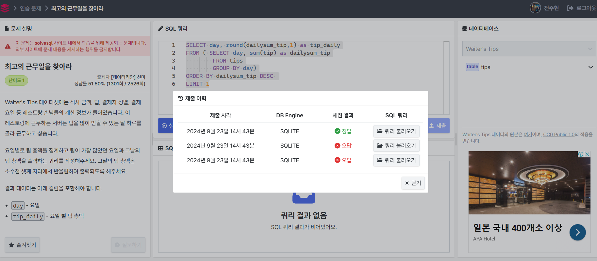

## 문제1: 우리 플랫폼에 정착한 판매자 

<문제>
`olist_order_items_dataset` 테이블에는 주문 안에 어떤 상품이 포함되어 있는지, 상품의 판매자는 누구인지 등 상품 단위의 데이터가 들어있습니다.

상품 가격이 50달러 이상인 주문이 100건 이상 들어온 판매자 리스트를 주문 건수가 많은 순서대로 출력하는 쿼리를 작성해주세요.

쿼리 결과에는 아래 컬럼이 있어야 합니다.

- `seller_id` - 판매자 ID
- `orders` - 판매자가 판매한 주문 건수

```sql
SELECT seller_id, COUNT(DISTINCT(order_id)) AS orders
FROM olist_order_items_dataset 
WHERE price >= 50
GROUP BY seller_id 
HAVING orders >= 100 
ORDER BY orders DESC
```

<오답 이유>
1. 처음에 order_id 개수를 셀 때 DISTINCT 처리를 하지 않았음.. 
2. ```SELECT → FROM → WHERE → GROUP BY → HAVING → ORDER BY``` 이 순서에 주의 (PRICE를 먼저 WHERE절로 처리하고, 집계함수를 사용한 orders는 HAVING으로 나중에 실현)
3. 마지막에 order 내림차순 정렬을 해야했다..(문제를 제대로 안읽음)


## 문제2:  몇 분이서 오셨어요?

<문제>
서빙했던 테이블 중 고객이 홀수 명이었던 경우만 보여주는 쿼리를 작성해주세요. 쿼리 결과에는 모든 컬럼이 출력되어야 합니다. 테이블 당 일행의 수는 `size` 컬럼에 들어있습니다. 예를 들어 5명이서 방문한 테이블의 `size` 컬럼은 값이 5입니다. 

``` sql
SELECT *
FROM tips
WHERE size%2 ==1;
```


## 문제3: 최고의 근무일을 찾아라


<문제>
Waiter's Tips 데이터셋에는 식사 금액, 팁, 결제자 성별, 결제 요일 등 레스토랑 손님들의 계산 정보가 들어있습니다. 이 레스토랑에 근무하는 서버는 팁을 많이 받을 수 있는 날 하루를 골라 근무하고 싶습니다.
요일별로 팁 총액을 집계하고 팁이 가장 많았던 요일과 그날의 팁 총액을 출력하는 쿼리를 작성해주세요. 그날의 팁 총액은 소수점 셋째 자리에서 반올림하여 출력되도록 해주세요.
결과 데이터는 아래 컬럼을 포함해야 합니다.

`day` - 요일

`tip_daily` - 요일 별 팁 총액

```sql
SELECT day, round(dailysum_tip,1) as tip_daily
FROM ( SELECT day, sum(tip) as dailysum_tip
        FROM tips
        GROUP BY day)
ORDER BY dailysum_tip DESC 
LIMIT 1
```

<오답 이유>
- 마지막에 제일 팁 많앗던 요일 1개만 출력하기 위해 `LIMIT` 함수를 걸었어야 했는데 안걸었다

> 서브쿼리에서 집계함수 쓰면 메인쿼리에서 못씀에 주의하자 

