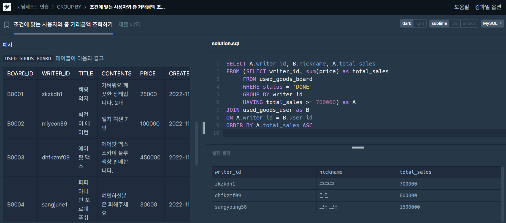

## 문제1) 조건에 맞는 사용자와 총 거래 금액 조회하기 



```sql
SELECT A.writer_id, B.nickname, A.total_sales
FROM 
    (SELECT writer_id, sum(price) as total_sales
     FROM used_goods_board
     WHERE status = 'DONE'
     GROUP BY writer_id
     HAVING total_sales >= 700000) as A
JOIN used_goods_user as B 
ON A.writer_id = B.user_id 
ORDER BY A.total_sales ASC 
```

[오답 이유]
- join 사용 주의: 메인쿼리에서 A(거래 자료 테이블)과 B(유저 테이블) 구분하기 
- MYSQL에서 JOIN 뒤에 `무엇을 기준으로` 조인할건지 알려주는 `ON` 절 빼먹지 않기... 

## 문제2) 업그레이드 할 수 없는 아이템 구하기

[문제]
각 아이템들은 오직 하나의 PARENT 아이템 ID 를 가지며, ROOT 아이템의 PARENT 아이템 ID 는 NULL 입니다.

더 이상 업그레이드할 수 없는 아이템의 아이템 ID(ITEM_ID), `아이템 명(ITEM_NAME)`, `아이템의 희귀도(RARITY)`를 출력하는 SQL 문을 작성해 주세요. 이때 결과는 아이템 ID를 기준으로 `내림차순` 정렬해 주세요.

```SQL
SELECT ITEM_ID, ITEM_NAME, RARITY
FROM  ITEM_INFO 
WHERE ITEM_ID NOT IN (SELECT DISTINCT PARENT_ITEM_ID
                      FROM ITEM_TREE
                      WHERE PARENT_ITEM_ID IS NOT NULL)
ORDER BY ITEM_ID DESC
```

[오답 이유, 문제 푸는 법]
- ITEM_A라는 아이템이 더이상 업그레이드 할 수 없으려면, **ITEM_A가 다른 아이템의 PARENT ITEM이 될 수 없으면** 된다. 
- 따라서 일단 PARENT_ITEM_ID가 NULL이 아닌(=ROOT ITEM이 아닌) 행 내에서 PRENT_ITEM 목록을 추출해 내고, 그 중에서 다른 아이템의 PARENT_ITEM이 될 수 없는 행들만 고른다. 
- 즉, ITEM_ID가 ITEM_TREE 테이블에서 PARENT_ITEM_ID로 있지 않는다면 된다는 뜻


## 문제3) 조건에 맞는 개발자 찾기

<문제> 
DEVELOPERS 테이블에서 Python이나 C# 스킬을 가진 개발자의 정보를 조회하려 합니다. 조건에 맞는 개발자의 ID, 이메일, 이름, 성을 조회하는 SQL 문을 작성해 주세요.

결과는 ID를 기준으로 오름차순 정렬해 주세요.


```SQL
select distinct id, email, firstname, lastname
from developers
join skillcodes on skillcodes.code & developers.skill_code=skillcodes.code
where skillcodes.name in ('C#','Python')
order by id
```

[오답 이유]
- 비트연산자를 모르겠음
- 비트연산자 공부 필요


**비트 연산의 의미**
- `skillcodes.code & developers.skill_code`: `developers.skill_code`에 설정된 비트 플래그가 skillcodes.code와 겹치는지 확인합니다.
    - 예를 들어, 개발자가 여러 기술을 가지고 있을 때, 그 기술들은 이진수 비트로 표현됩니다.     `skillcodes.code` 와 `developers.skill_code`의 비트 값을 `AND` 연산하여 공통 비트가 있는지 확인합니다.
- 만약 developers.skill_code에 C# 또는 Python에 해당하는 비트가 설정되어 있다면, AND 연산의 결과는 `skillcodes.code`와 동일하게 나옵니다.
